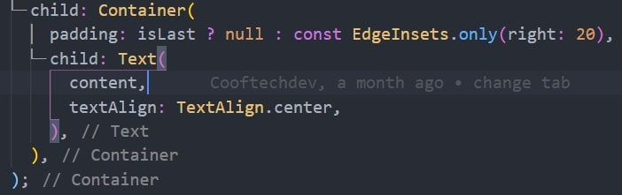
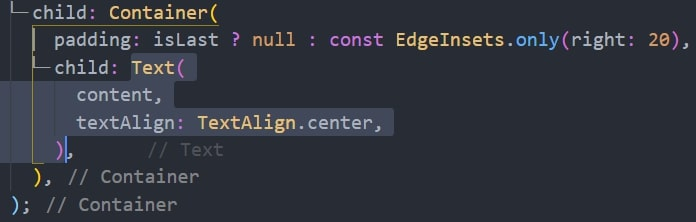

This package help you to quickly select the widget. Then, you can copy, delete, cut or do what ever you want.
Press Alt + W (option + W on Mac) inside a widget to use.

Press Alt W, it auto select widget for you.

Press Alt W again, The parent of the selected widget will be selected too.